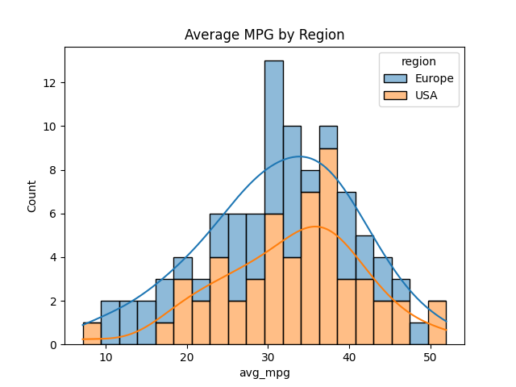
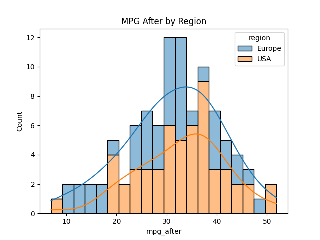
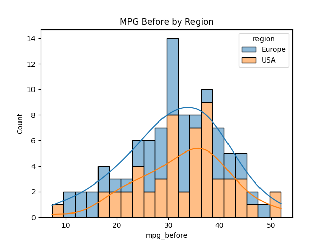
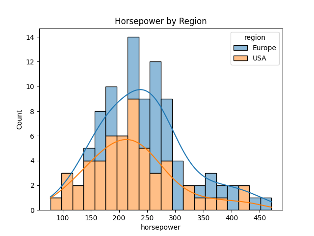
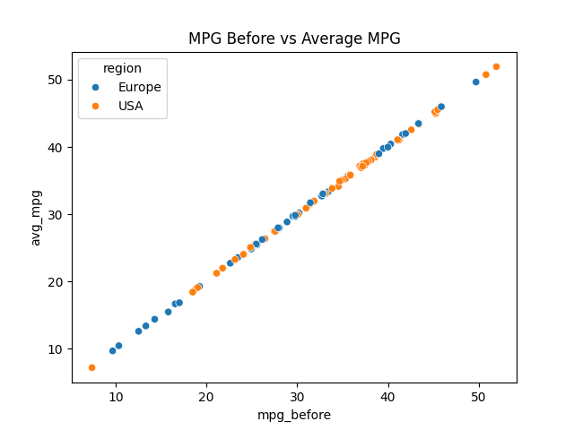

# PythonCarMPG

Created histograms to visually compare the two different regions Europe Vs USA miles per gallon before 75,000 miles, after 75,000 miles and the average miles per gallon.    

Another histogram to compare horsepower between the two regions, which shows that Europe cars may have more horsepower compared to USA.

