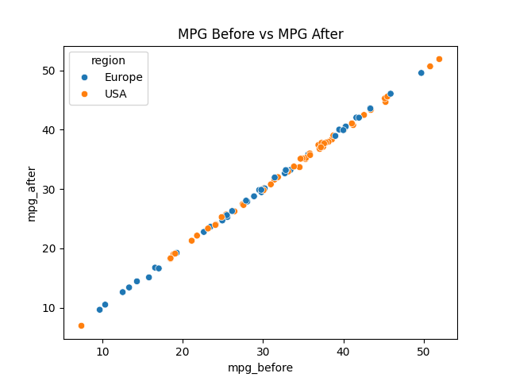
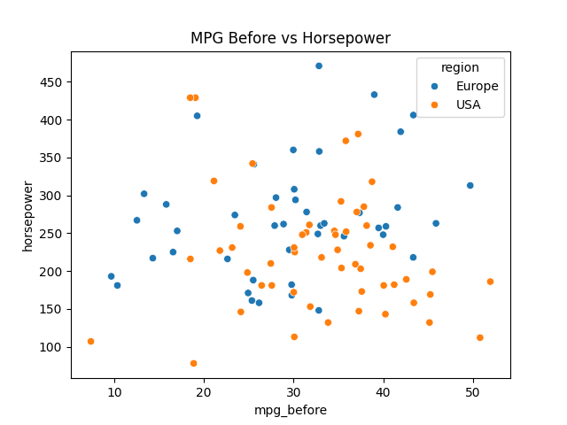

# PythonCarMPG

Created histograms to visually compare the two different regions Europe Vs USA miles per gallon before 75,000 miles, after 75,000 miles and the average miles per gallon.    

Another histogram to compare horsepower between the two regions, which shows that Europe cars may have more horsepower compared to USA.

Created two scatter plots comparing MPG before to Average MPG and MPG after, both have a strong positive relationship to each other.  

While a scatter plot comparing MPG before to horsepower shows there is no relationship between horse power to MPG before. 

Created confidence intervals to compare if one region has cars with more horsepower than another and the results were. 
95% Confidence Interval for Horsepower in Europe: 245.49 to 291.51
95% Confidence Interval for Horsepower in USA: 202.46 to 244.25
Since the confidence intervals do not overlap, it strongly suggests that European cars tend to have higher horsepower than American cars in this dataset.
Another confidence interval to compare average MPG resulted in 
95% Confidence Interval for AVG MPG in Europe: 26.38 to 32.47
95% Confidence Interval for AVG MPG in USA: 30.54 to 35.35
Since these confidence intervals overlap (30.54 MPG from the USA falls within the European range), we cannot confidently conclude that one region has significantly better fuel efficiency than the other.
Lastly created a confidence interval to determine if cars lose fuel efficiency after driving over 75,000 miles
99% Confidence Interval for MPG Difference in Europe: -0.039 to 0.16
99% Confidence Interval for MPG Difference in USA: -0.12 to 0.07
Since both confidence intervals contain 0, it suggests that there is no statistically significant difference in MPG before and after 75,000 miles at the 99% confidence level.
